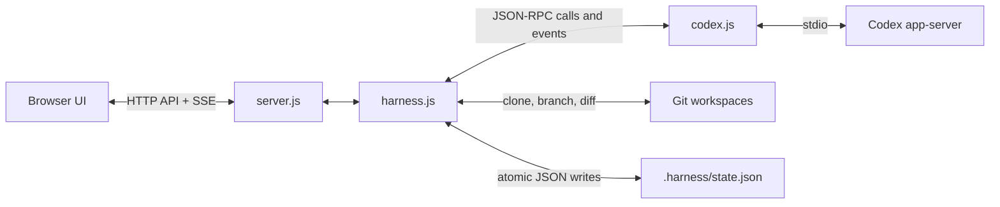
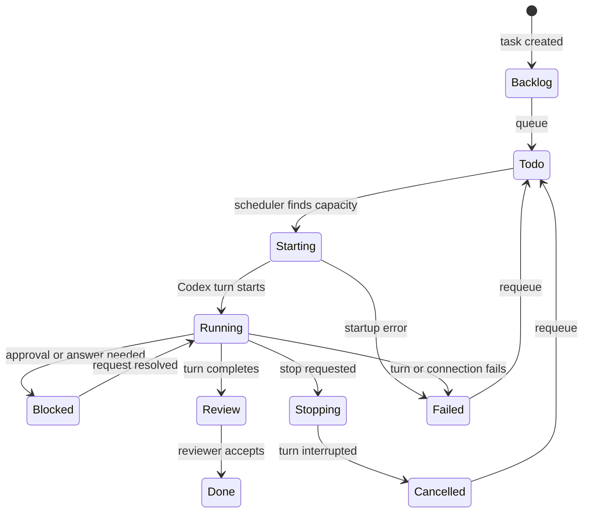
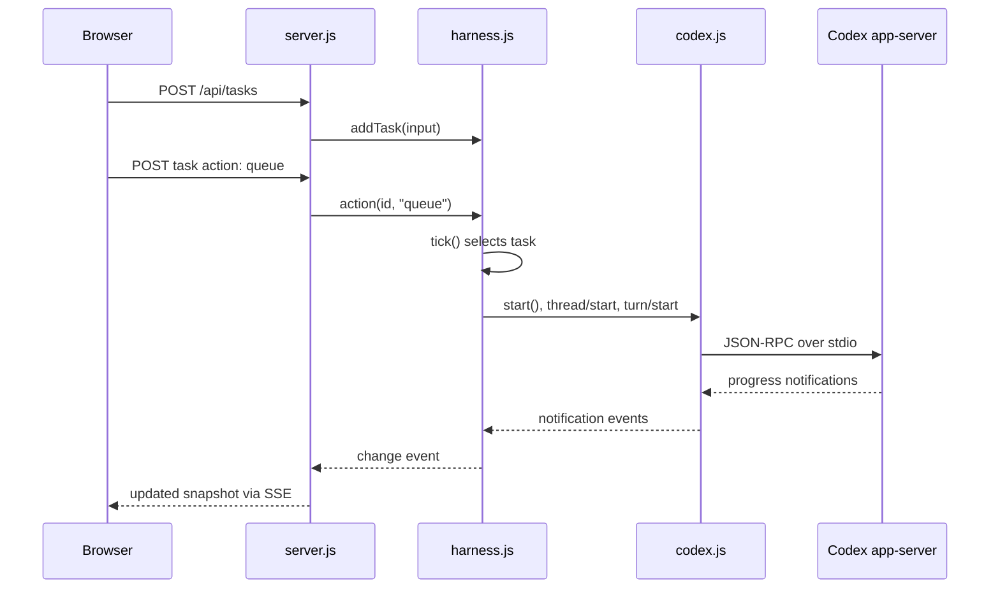

# `src` guide

The backend is dependency-free Node.js. It connects the browser UI to Codex, stores task state, schedules work, and serves live updates.

## `codex.js`

`Codex` is an `EventEmitter` wrapper around `codex app-server`.

- Starts the Codex child process and communicates through newline-delimited JSON on standard I/O.
- Performs the `initialize` handshake.
- Matches RPC responses to pending calls by ID and applies a 30-second timeout.
- Emits Codex-initiated `notification` and `request` events for the harness.
- Rejects pending calls and emits `disconnect` if the process fails or exits.
- Leaves OAuth credentials and refresh handling entirely to the Codex CLI.

## `harness.js`

`Harness` owns persistent state, queue scheduling, isolated task workspaces, and Codex run lifecycle.

- Loads and atomically saves projects, tasks, concurrency, and pause state in `state.json`.
- Creates a Git repository at a user-chosen, primary project location or validates an existing repository root.
- Creates tasks in `backlog`, then dispatches queued (`todo`) tasks up to the configured concurrency.
- Clones each project into a readable, task-specific workspace and creates a `cadence/<context>--cd-N` branch.
- Starts a Codex thread and turn for each run, forwarding the task title and description.
- Converts Codex notifications into output, activity logs, diffs, token usage, and task status.
- Holds approval and question requests in memory, then returns browser answers to Codex.
- Computes review data from the Git diff against the task's original base commit plus untracked-file diffs.
- On explicit confirmation, commits the reviewed workspace and fetches its branch into the primary local repository without checking it out, merging, or pushing.

## `server.js`

This file wires `Codex` and `Harness` together and exposes the local web application.

- Binds an HTTP server to `127.0.0.1` on `PORT` or `4310`.
- Rejects unexpected hosts, cross-origin requests, and cross-site requests; also sets a restrictive Content Security Policy.
- Serves the three static files in `public/`.
- Exposes JSON endpoints for state, account details, models, projects, tasks, settings, task actions, approvals, and diffs.
- Streams state snapshots to browsers with Server-Sent Events whenever the harness revision changes.
- Calls the scheduler every second and checks for state changes every 350 ms.
- Caches account and rate-limit data for 60 seconds.
- Gracefully closes timers, SSE clients, the harness, and the HTTP server on termination signals.

