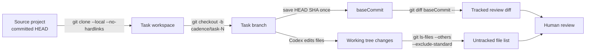
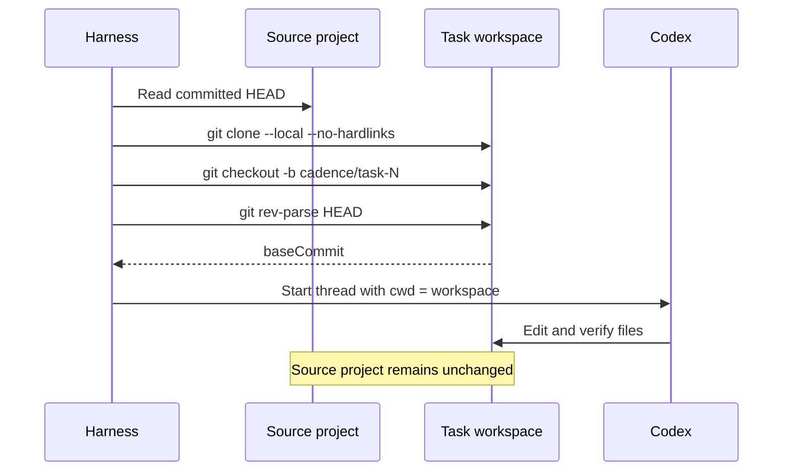
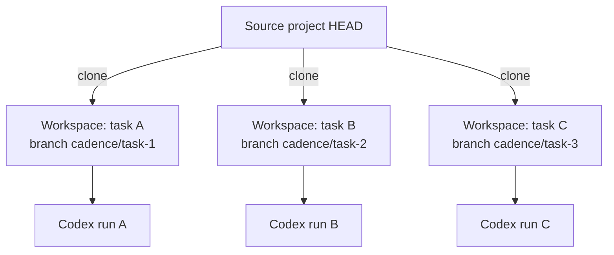
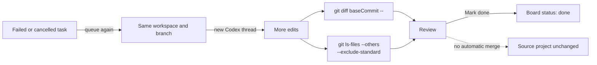

# Git flow in `src/harness.js`

The harness isolates each task in its own clone. It never merges, pushes, or copies task changes back to the source project.

## Map

| Moment | Git behavior |
| --- | --- |
| Add existing project | Verifies the path is the repository root and that `HEAD` exists. |
| Add blank project | Runs `git init -b main`, adds `README.md`, and creates an initial commit. |
| First task run | Clones the project, creates `cadence/task-N`, and records its starting `HEAD` as `baseCommit`. |
| Rerun | Reuses the same workspace, branch, changes, and `baseCommit`; it does not clone or reset again. |
| Review | Shows tracked changes since `baseCommit` and lists untracked files. |
| Mark done | Changes board state only; no commit, merge, push, or source-repository update occurs. |

## Scenario: first run

Only committed source state is cloned. Source-project uncommitted and untracked files are absent from the task workspace.

## Scenario: concurrent tasks

Each active task edits a separate clone, so concurrent runs do not share working-tree changes. A later task still clones the source project, not another task's workspace.

## Scenario: rerun and review

The original `baseCommit` remains the comparison point across attempts, so review covers the task's accumulated tracked changes.

## Operational boundaries

- The task instructions explicitly prohibit push, merge, and publish operations.
- The task branch may contain uncommitted edits; the harness does not require Codex to commit.
- Untracked file names appear in review, but their contents are not included in the tracked diff.
- Decreasing concurrency or pausing the queue does not combine or move Git branches; it only controls future dispatch.
