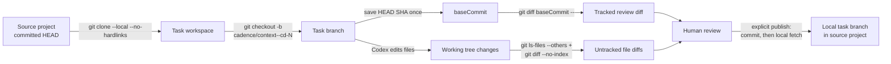
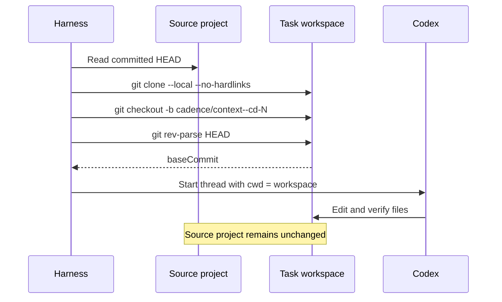
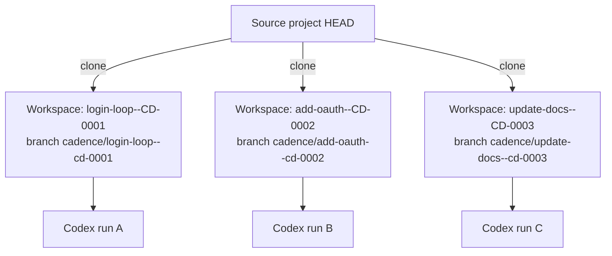
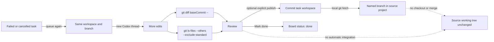

# Git flow in `src/harness.js`

The harness isolates each task in its own clone. It never merges or pushes. After human review, an explicit publish action can commit the workspace and fetch its task branch into the primary local repository without changing that repository's checked-out files.

## Map

| Moment | Git behavior |
| --- | --- |
| Add existing project | Verifies the path is the repository root and that `HEAD` exists. |
| Add blank project | Creates the primary repository at the user-chosen location, runs `git init -b main`, adds `README.md`, and creates an initial commit. |
| First task run | Clones the project into a readable project/task path, creates `cadence/<context>--cd-N`, and records its starting `HEAD` as `baseCommit`. |
| Rerun | Reuses the same workspace, branch, changes, and `baseCommit`; it does not clone or reset again. |
| Review | Shows tracked changes since `baseCommit` and includes diffs for untracked files. |
| Publish local branch | Stages and commits reviewed changes in the workspace, then fetches that branch into the primary repository. It does not check out, merge, or push. |
| Mark done | Changes board state only and warns if the result has not been published locally. |

## Scenario: first run

Only committed source state is cloned. Source-project uncommitted and untracked files are absent from the task workspace.

## Scenario: concurrent tasks

Each active task edits a separate clone, so concurrent runs do not share working-tree changes. A later task still clones the source project, not another task's workspace.

## Scenario: rerun and review

The original `baseCommit` remains the comparison point across attempts, so review covers the task's accumulated tracked changes.

## Operational boundaries

- The task instructions explicitly prohibit push, merge, and publish operations.
- The task branch may contain uncommitted edits; the harness does not require Codex to commit. Cadence commits only after the user explicitly selects **Publish local branch**.
- Review presents the tracked diff and separate untracked-file diffs before publication.
- Publishing uses a filesystem path between local repositories, so no GitHub or other hosted remote is required.
- Git rejects a non-fast-forward update or an update to a checked-out destination branch. The workspace commit remains available if the fetch fails.
- Decreasing concurrency or pausing the queue does not combine or move Git branches; it only controls future dispatch.
